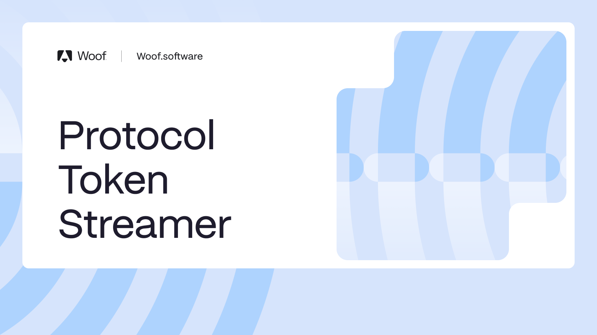

# Compound Streamer

## TL;DR

[Streamer.sol](./contracts/Streamer.sol) - The Streamer smart contract enables linear streaming of value from a native asset to a recipient, denominated in a specified ERC-20 token (the streaming asset), over a defined time period. It integrates with AggregatorV3Interface to convert between the native and streaming assets using real-time USD price feeds. The contract also supports configurable slippage tolerance to account for price volatility in the streaming asset.

Key features:

    1. Stream creation and initialization
    2. Accrual and claim of streaming tokens
    3. Stream termination with notice period
    4. Rescue of non-streaming tokens
    5. Sweeping of unclaimed tokens before initialization and after stream end

This contract is typically used for scheduled payments or vesting mechanisms with off-chain enforcement and real-time pricing.

[StreamerFactory.sol](./contracts/StreamerFactory.sol) - The Streamer Factory is a smart contract that enables the deployment of new Streamer instances using CREATE2 allowing for deterministic and predictable contract addresses. The contract utilizes a unique counter per deployer for a unique salt generation. It supports customizable parameters for each deployment, including the streaming and native assets, price oracles, slippage tolerance, cooldown periods, and stream duration. The Factory ensures a safe and flexible way for users to deploy tailored Streamer contracts with full control over configuration.
**⚠️ Warning**
Be carefully when submitting multiple deployment transactions as the deployed addresses might differ from precomputed in case they are executed out of order.

Read more on [Compound Forum](https://www.comp.xyz/t/compound-streamer-universal-asset-streaming-infrastructure/6861)

## Deployed Contracts

| Network | Contract Name            | Address                                    | Link                                                                            |
| ------- | ------------------------ | ------------------------------------------ | ------------------------------------------------------------------------------- |
| Mainnet | StreamerFactory Contract | 0x50EF9A4E151C4539453A91FA1ab7e1cF4dc8BDDe | [Link](https://etherscan.io/address/0x50EF9A4E151C4539453A91FA1ab7e1cF4dc8BDDe) |
| Mainnet | Constant Price Feed      | 0xD72ac1bCE9177CFe7aEb5d0516a38c88a64cE0AB | [Link](https://etherscan.io/address/0xD72ac1bCE9177CFe7aEb5d0516a38c88a64cE0AB) |

Use [Chainlink](https://docs.chain.link/data-feeds/price-feeds/addresses?network=ethereum&page=1&testnetPage=1) or any other price provider to find proper price feeds.

## Examples

### Example 1. Distribute 1M worth of USDC in COMP

There is a need to distribute 1 million USDC worth of COMP tokens over 1-year period. Assuming that the price of COMP is $40 and 1 USDC = 1 USD:

```solidity
deployFactory(
    0xc00e94cb662c3520282e6f5717214004a7f26888, // Address of COMP
    0xa0b86991c6218b36c1d19d4a2e9eb0ce3606eb48, // Address of USDC
    0xdbd020CAeF83eFd542f4De03e3cF0C28A4428bd5, // Valid COMP/USD Price Feed
    0x8fFfFfd4AfB6115b954Bd326cbe7B4BA576818f6, // Valid USDC/USD Price Feed
    0x<RETURN_ADDRESS>, // Address where the surplus of COMP will be returned
    0x<STREAM_CREATOR>, // Address of the Stream owner who can initialize stream, sweep and rescue tokens
    0x<RECIPIENT_ADDRESS>, // Stream receiver
    1000000000000, // $1M with 6 decimals
    500000, // Slippage param (e.g., 0.5% = 5e5)
    604800, // 7-day claim cooldown (min 1 day). After `lastClaim + cooldown`, anyone can trigger the claim for the receiver.
    864000, // 10-day sweep cooldown after stream ends. Surplus assets can be swept to RETURN_ADDRESS.
    31536000, // 365 days in seconds (stream duration)
    2592000 // 30-day minimal notice period
);
```

A total of 2,739 USDC worth of COMP will be distributed daily. COMP amount will be calculated at the moment of claim based on price feed information.

### Example 2. Distribute 1M worth of USD in COMP

There is a need to distribute 1M worth of USD in Comp tokens. Assuming that the price of COMP is $40:

```solidity
deployFactory(
    0xc00e94cb662c3520282e6f5717214004a7f26888, // Address of COMP
    0xdac17f958d2ee523a2206206994597c13d831ec7, // Address of USDT (used to represent USD with 6 decimals)
    0xdbd020CAeF83eFd542f4De03e3cF0C28A4428bd5, // Valid COMP/USD price feed
    0xD72ac1bCE9177CFe7aEb5d0516a38c88a64cE0AB, // Constant price feed returning 1 USD
    0x<RETURN_ADDRESS>, // Address to receive surplus COMP after stream ends
    0x<STREAM_CREATOR>, // Address of the Stream owner who can initialize stream, sweep and rescue tokens
    0x<RECIPIENT_ADDRESS>, // Stream receiver address
    1000000000000, // Stream amount: $1M in 6 decimals
    <SLIPPAGE>, // Slippage parameter (e.g., 5e5 = 0.5% reduction)
    <CLAIM_COOLDOWN>, // Cooldown (in seconds) before anyone can claim on behalf of receiver
    <SWEEP_COOLDOWN>, // Cooldown (in seconds) before surplus can be swept back to RETURN_ADDRESS
    31536000, // Duration of the stream in seconds (365 days)
    <MINIMUM_NOTICE_PERIOD> // Minimum notice period (in seconds) before stream changes or termination
);
```

A total of 2,739 USD worth of COMP will be distributed daily. COMP amount will be calculated at the moment of claim based on price feed information.

### Example 3. Distribute 1M worth of USDC in WETH

There is a need to distribute 1M worth of USDC in WETH. Assuming that the price of WETH is $2500 and 1 USDC = 1 USD:

```solidity
deployFactory(
    0xc02aaa39b223fe8d0a0e5c4f27ead9083c756cc2, // Address of Wrapped ETH (WETH)
    0xa0b86991c6218b36c1d19d4a2e9eb0ce3606eb48, // Address of USDC (6 decimals)
    0x5f4eC3Df9cbd43714FE2740f5E3616155c5b8419, // Valid ETH/USD price feed
    0x8fFfFfd4AfB6115b954Bd326cbe7B4BA576818f6, // Valid USDC/USD price feed
    0x<RETURN_ADDRESS>, // Address to receive surplus WETH after stream ends
    0x<STREAM_CREATOR>, // Address of the Stream owner who can initialize stream, sweep and rescue tokens
    0x<RECIPIENT_ADDRESS>, // Stream receiver address
    1000000000000, // Stream amount: $1M in 6 decimals
    <SLIPPAGE>, // Slippage parameter (e.g., 5e5 = 0.5% reduction)
    <CLAIM_COOLDOWN>, // Cooldown (in seconds) before anyone can claim on behalf of receiver
    <SWEEP_COOLDOWN>, // Cooldown (in seconds) before surplus can be swept back to RETURN_ADDRESS
    31536000, // Stream duration in seconds (365 days)
    <MINIMUM_NOTICE_PERIOD> // Minimum notice period (in seconds) before stream changes or termination
);
```

A total of 2,739 USDC worth of WETH will be distributed daily. WETH amount will be calculated at the moment of claim based on price feed information.

## Streamer lifecycle

### Deployment

The deployment is performed via `deployStreamer` function of StreamerFactory. Make sure to prepare all the necessary parameters which include:

- `_streamingAsset` and `_nativeAsset`. Make sure that these are valid ERC-20 tokens. Do not use tokens with multiple addresses as `_streamingAsset`.
- `_streamingAssetOracle` and `_nativeAssetOracle`. Streamer is designed to work with the Chainlink Price Feeds which return price in USD, however, Streamer can work with any oracles which support AggregatorV3Interface and return the price in USD.
- `_returnAddress`, `_recipient`, `_streamCreator`. Ensure that these are valid addresses which are entitled to receive ERC-20 tokens. `_recipient` should be able to call the function `claim()` of the Streamer. `_streamCreator` should be able to call functions `initialize()`, `sweepRemaining()`, `rescueToken()`, `terminateStream()`.
- `_nativeAssetStreamingAmount`. An amount of Native asset to be streamed. This value should have number of decimals equal to the number of decimals in Native Asset.
- `_slippage`. A slippage parameter used to reduce the price of the streaming asset. For example, to set slippage to 0.5% use 5e5.
- `_claimCooldown`, `_sweepCooldown`, `_streamDuration`, `_minimumNoticePeriod`. Set cooldown periods in seconds. Minimal period is 1 day. `_minimumNoticePeriod` must be shorter that `_streamDuration`.
  **Note!** For more details about parameter check the documentation of Streamer.

> Call the function `deployStreamer` with the necessary parameters of a new Streamer.

> **Slippage tip** Set up slippage based on price feed deviation and DEX slippage. In case the COMP/USD price feed deviation is 0.5% and the DEX slippage is 0.5%, it is better to set up a 1% slippage to avoid losing USD value altogether.

### Initialization

In order to start the stream, the function `initialize` must be called by Stream Creator.
Before calling this function, The Streamer smart contract should have enough Streaming asset tokens on its balance. You can calculate the necessary amount of Streaming asset using the function `calculateStreamingAssetAmount()`.
**Note!** due to the price fluctuations between assets, we recommend transferring extra amount of streaming asset, for example, extra 10%.

> The Stream Creator should call the function `initialize`.

### Main flow of the Streamer. Claim, terminate, sweep.

**Claim process**
The recipient is able to claim Streaming asset during the streaming period or claim all after the end of stream. Streaming asset is allocated linerly each second.
Additionally, the `claim()` function can be called by anyone after the `claimingPeriod` has passed since the last claiming. This is implemented to ensure that the recipient won't wait too long for a more favorable price of assets.

> Recipient is able to call function `claim()` during the stream period and after the stream end to claim allocated Streaming asset tokens.

**Termination process**
Stream creator is able to stop the stream at any time while the stream is active using the function `terminateStream()`. Termination of the stream means that the allocation will be fully stopped after the `terminationTimestamp`. The stream will continue to accrue tokens for a certain period of time (notice period), which lasts till the `terminationTimestamp`. The function accept parameter `_terminationTimestamp`. This parameter should be equal the timestamp upon which the distribution of asset will be stopped. Also, it can be passed as 0, in which case the terminationTimestamp will be calculated inside the function. See description of `terminateStream()` for more details.

> Stream creator is able to call function `terminateStream()` to stop distribution of Streaming asset. This process is irreversible. Stream can be terminated only once.

**Sweep Process**
Streaming asset tokens can be swept from the Streamer's balance using the function `sweepRemaining()`.

- Before initialization of the stream, Stream Creator can call the function without any conditions.
- After initialization, Stream Creator can call the function only after the end of stream (or after termination timestamp if stream is terminated).
- Anyone can call the function after `sweepCooldown`.

> `sweepRemaining()` can be called in order to sweep remaining balance of Streaming asset provided the mentioned conditions are met.

### Rescuing of stuck tokens

> Stream Creator is able to call function `rescueToken()` on order to withdraw any ERC-20 token from the Streamer's balance except Streaming asset.

## Installation

Prerequisites: install [Node.js](https://nodejs.org/en/download/package-manager) 22.10+ with `pnpm` and [Visual Studio Code](https://code.visualstudio.com/download).

Open [the root of the project](./) using Visual Studio Code and install all the extensions recommended by notifications of Visual Studio Code, then restart Visual Studio Code.

Open the terminal and run the command below to install all the dependencies and prepare the project:

```shell
pnpm i
```

Run to view commands:

```shell
pnpm run
```

## Some unsorted notes

### Commands

- `pnpm coverage` shows all coverage and `pnpm test` runs all Hardhat and Foundry tests.
- `pnpm testh:vvv test/SomeContract.ts` and `pnpm testf -vvv --mc SomeContractTests` show details about events, calls, gas costs, etc.
- `pnpm coveragef:sum` show a coverage summary with branches for Foundry.

### Environment variables

The project can properly work without the \`.env\` file, but supports some variables (see `.env.details` for details). For example:

- `BAIL=true` to stop tests on the first failure.
- `EVM_VERSION="default"` and `HARDFORK="default"` if you would not like to use Prague, but would like Hardhat to behave by default.
- `VIA_IR=false` to disable IR optimization. You may also need to disable it in `.solcover.js` if compilation issues when running coverage.
- `COINMARKETCAP_API_KEY` and `ETHERSCAN_API_KEY` if you would like to see gas costs in dollars when running `pnpm testh:gas`.

### VS Code

- The `Watch` button can show/hide highlighting of the code coverage in the contract files after running `pnpm coverage`. The button is in the lower left corner of the VS Code window and added by `ryanluker.vscode-coverage-gutters`.
- Open the context menu (right-click) in a contract file, after running `pnpm coverage`, and select "Coverage Gutters: Preview Coverage Report" (or press Ctrl+Shift+6) to open the coverage HTML page directly in VS Code.
- Start writing `ss` in Solidity or TypeScript files to see some basic snippets.

## Troubleshooting

Run to clean up the project:

```shell
pnpm run clean
```

Afterwards, try again.
